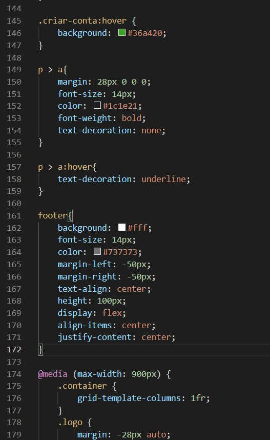

# Clonando o site do FaceBook

Conteúdo criado para fins de estudo

>  Ferramentas usadas: HTML e CSS

### Resultado

 

- A primeira imagem, é do "cabeçalho do HTML " com todas as informações de "configuração" como: tipo, idioma, metadados, título e link com o CSS 

- Na parte do body, desevolve-se todo o conteúdo da página
- As TAGs <.div> que representa seus "filhos", ele pode ser usado com o atributo class, lang or title para marcar uma semântica comum a um grupo de elementos
  - Primeira DIV, agrupa todo o conteúdo da página, podendo atribuir estilo a página a partir do nome dado a DIV. Ela vai estilizar o comportamento da página em geral e como o conteúdo é distribuido e adaptado
  - *CLASS* é um tipo de seletor para conexão com o CSS
  - *ALT* é o nome que dado a foto, caso ela não carregue na página
- Para adicionar a imagem e um texto próximo a imagem, foi usado outra **DIV** dentro da **DIV "container"**, pois esse conteúdo ganhará uma estilização e será disposto em um lugar diferente na página. Esta **DIV** também ganhou uma *CLASS* "intro"

- O elemento <img também ganhou uma *CLASS*"logo", pois assim eu poderia estilizar de uma forma diferente do que o conteúdo da DIV "intro".

- O conteúdo da **DIV** "intro" foi fechado

- Outra **DIV** foi aberta, não sendo necessário *CLASS*, pois cada item dentro desta, ganhou um nome.

  - Criei um elemento **FORM**, ele elemento é o local onde o usuário vai inserir os dados e password - INTERATIVIDADE-

- **INPUT**, é a ferramenta insere o elemento onde o usuário vai preencher as informações solicitadas, neste caso, e-mail e password

  - Dentro do elemento **INPUT**, é colocado o tipo **(type="text")**
  - Também dentro do mesmo **INPUT**, foi adicionado **PLACEHOLDER**, é o texto dizendo o que o usuário deve digitar, neste caso, "E-mail ou Telefone"
  - O outro **INPUT** é onde o usuário vai inserir a senha ou "password"
- O elemento **BUTTON** também ganhou uma *CLASS* "criar-conta"

  - Encerra-se o elemento **FORM**

- Ainda dentro da mesma **DIV** foi criado uma frase, usando a TAG **P** e dentro desta TAG usei o elemento **a**

  - **A** representa um hiperlink (onde o mouse clica e vai para outra página), neste caso somente uma parte da frase é um hiperlink

## CSS

- O primeiro seletor da foto abaixo é um "*" ele é um seletor universal, neste caso, foi usado para declarar o comportamento das propriedades de altura e largura, e os valores podem ser ajustados a partir de 2 propriedades:

  - *CONTENT-BOX* e *BOX-SIZING
- **BODY** é a estilização de toda a página, margem, area de preenchimento, background, tipo da font
- **CONTAINER** / **INTRO** / **LOGO** / **ENTRAR**/ **CRIAR-CONTA** é a estilização do conteúdo que ganhou essa *CLASS* no HTML
- Toda a estilização deve acontecer com uma certa ordem, de acordo com os elementos do HTML
- *grid-template-columns* - especifica, como uma lista de trilhas separadas por espaço, os nomes das linhas e as funções de dimensionamento das trilhas da grade.
- *GAP* - A propriedade CSS gap é uma propriedade abreviada para gap de linha e gap de coluna especificando as medianizes entre as linhas e colunas da grade.
- *max-width*  - Permite que os autores restrinjam a largura do conteúdo a um determinado intervalo.
- *DISPLAY* - A propriedade CSS de exibição define se um elemento é tratado como bloco ou elemento embutido e o layout usado para seus filhos, como layout de fluxo, grade ou flex.
- A foma (form a, input, button) - é como é colocado um mesmo estilo para todo o conteúdo desta sessão.
- Foi utilizado na estilização deste conteúdo, os chamado **PSEUDO-CLASSES** (input:focus{}) é uma palavra-chave adicionada a seletores que especifica um estado especial do elemento selecionado. *OBS*: Existem mais de 30 PSEUDO-CLASSES.
- Também foi utilizado na estilização deste conteúdo, os chamado **PSEUDO-ELEMENTS** (input::placeholder{}) aplica estilos em partes do conteúdo do seu documento em cenários onde não há elementos HTML específicos para selecionar. Por exemplo, em vez de colocar a primeira letra para cada parágrafo em seu próprio elemento. você pode estilizá-los todos com `p`[`::first-letter`](https://developer.mozilla.org/pt-BR/docs/Web/CSS/::first-letter).

